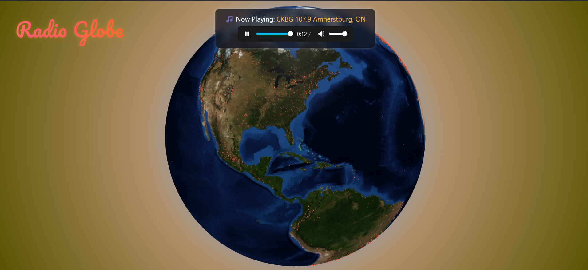
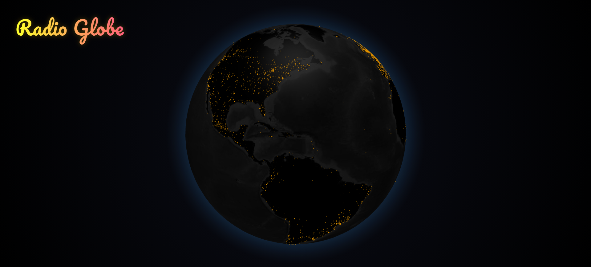

Radio Globe 🌎

Radio Globe is a web application that lets you explore live radio stations from around the world on an interactive 3D globe. Click a station to start streaming its live audio.

## Screenshots

### Day Mode

### Night Mode

🚀Features

Explore thousands of radio stations worldwide.

Interactive 3D globe interface with day/night theme.

Animated retro-style logo.

Audio playback directly in the browser.

Responsive design for all screen sizes.

✨Usage

Click on any point on the globe to play a station.

Hover over a point to see the station name.

Globe automatically switches between day and night themes based on local time.

⚡Tech Stack

Frontend: React, Vite, Three-Globe

Backend: Flask, Python

Streaming: HLS.js for live radio playback

Other: CSS animations for logo
